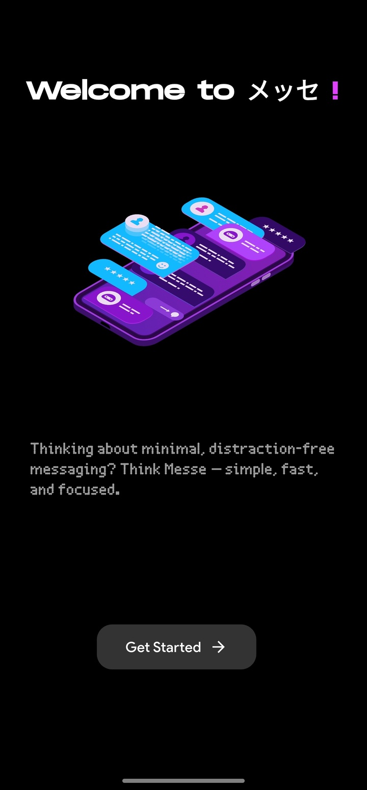
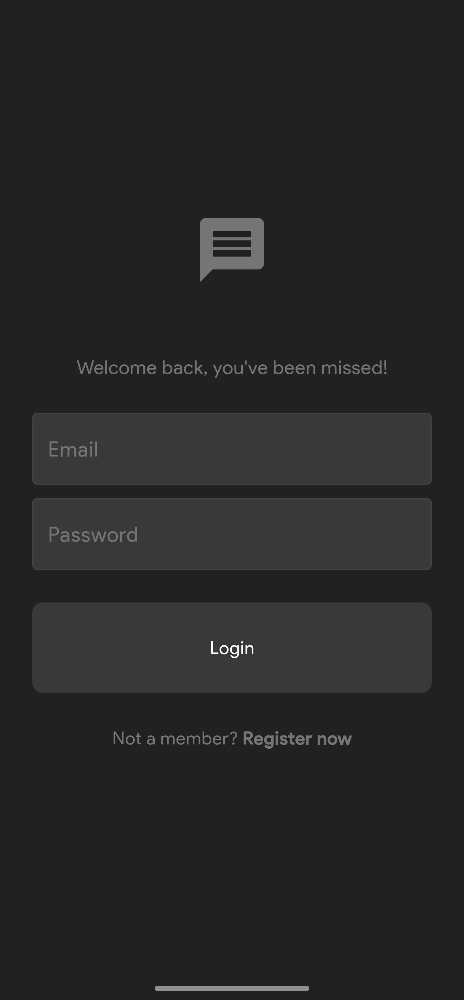
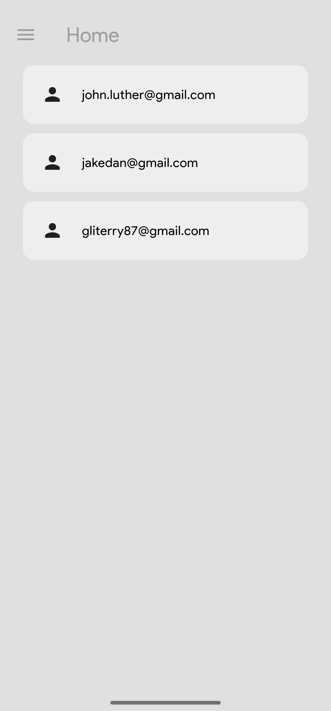
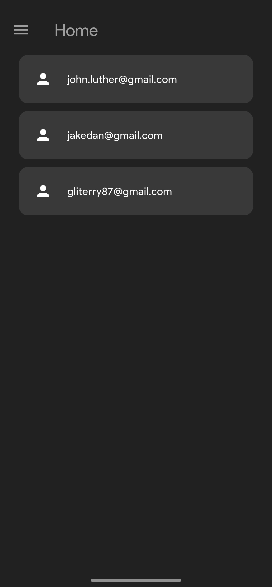
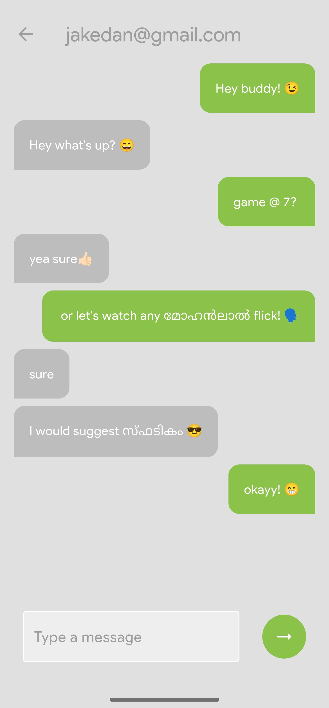
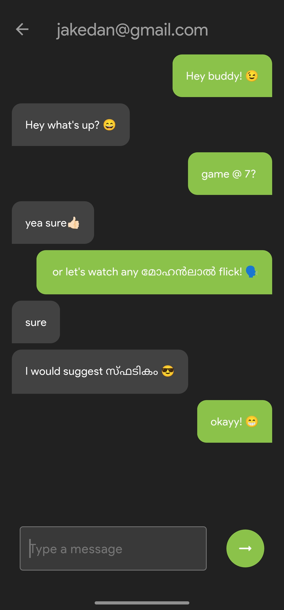
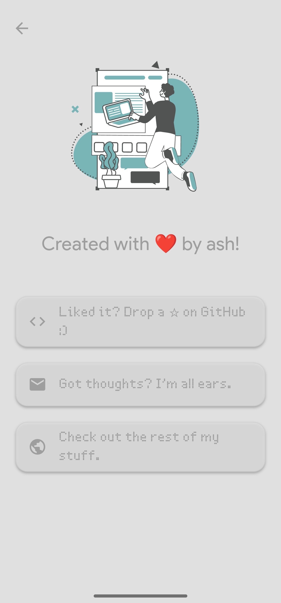
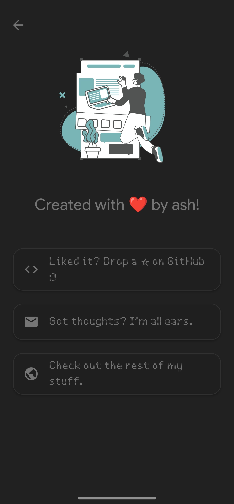

# Messe 📲

Thinking about minimal, distraction-free messaging? Think **Messe** — simple, fast, and focused.  
Messe is a Flutter-based social communication app designed for real-time messaging using Firebase.

## 🚀 Features
- 🔐 Firebase Authentication
- 💬 Real-time, one-to-one messaging
- ☁️ Cloud Firestore for message storage
- 📁 Firebase Storage for media attachments
- 📱 Clean, mobile-friendly UI with minimal distractions

## 📸 Screenshots

### 🔐 Splash Screen


### 🔐 Register Screen


### 🔐 Home Screen (light-mode)


### 🔐 Home Screen (dark-mode)


### 🔐 Chat Interface (light-mode)


### 🔐 Chat Interface (dark-mode)


### 🔐 About Screen (light-mode)


### 🔐 About Screen (dark-mode)



## 🛠️ Tech Stack
- **Flutter** for cross-platform UI
- **Firebase Auth** for user login/signup
- **Cloud Firestore** for real-time database
- **Firebase Storage** for uploading images/files

## 📱 Try the App

- [⬇️ Download Messe for Android](https://github.com/a5xwin/Messe/releases/latest/download/messe.apk)  

> _Tip: If prompted, allow installation from unknown sources._


## 🧑‍💻 Getting Started with Development (For Testers)

1. Clone the repository  
   ```bash
   git clone https://github.com/a5xwin/Messe.git
   cd Messe

2. Install dependencies
    ```bash
    flutter pub get

3. Run the app
    ```bash
    flutter run


